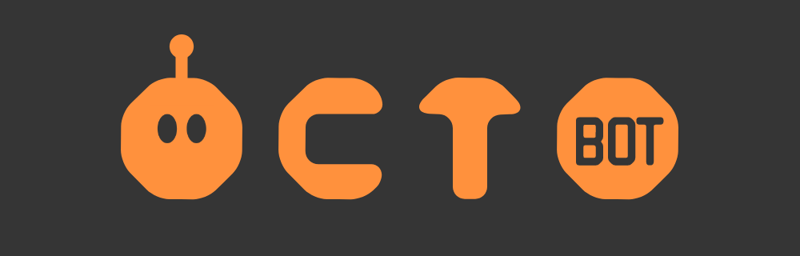

The development of this bot is currently inactive. If you would like to contribute to it, please submit a pull-request.

`Submit an issue if you find a bug`

Octobot is an extremely work-in-progress opensource bot.

**Documentation in progress.**

Wrong branch? Check out our test-build instead. in-dev builds are extremely experimental and things are garuanteed to break.

## To-do:

- [X] Duty command
  - [X] Fix duty command and get idle features working
- [X] Debug mode
  - [X] Debugging checker
  - [X] Toggable mode via package.json (true/false)
- [X] Modular commands 
  - [ ] ~~Make sure to add try/catch and handle errors as redis loves to mess up~~ (We've disabled Redis dependencies for now)
  - [X] Modularity for news and agenda channels.
  - [ ] Get the bot to find a channel name called "news" and let that process be embedded by default so we don't need to change webhooks manually or have Octobot post them (which would be easier.

## Dependencies & Pre-requisites

**Platforms**

```
Windows :Visual Studio Code (there's a launch.json file located in ./.vscode/)
```

```
Linux: Atom or command line. (Follow the Linux guide below)
```

## Contribute to our code (git)

```cmd
git clone orangopus/octobot
```

Dependencies can be found in `package.json`

Huge thanks to the collective for contributing to this project, its goals and sharing code to make this project a reality.

Also thanks to our contributors for helping put this project together & collectively learning how to make this!

**Backers:**

See our donations on our [OpenCollective](https://opencollective.com/Orangopus). We'll have some shields here soon.

## EXPERIMENTAL ~ Running an instance of Octobot

**Start the bot:**

We recommend Linux for advanced users.

We recommend Windows Visual Studio Code for 
people who are new to coding or just want to
experiment in our test-build and in-dev branches.

*If you're stuck on something, just let us know in #support on [Discord](https://go.orangop.us/discord).*

**Make sure to do `npm init` to grab packages and dependencies.**

`npm install` inside of the Octobot folder - Ignore work in progress things.

`pm2 start bot.js`

Don't worry if it errors or tells you about promise catches. That's fine, we're still actively fixing bugs.

Submit a pull request if you want to fix something!

## COMING SOON - Add Octobot to your own server

 Wait for production build soon. ~ We're looking into scalable VPS solutions. 
